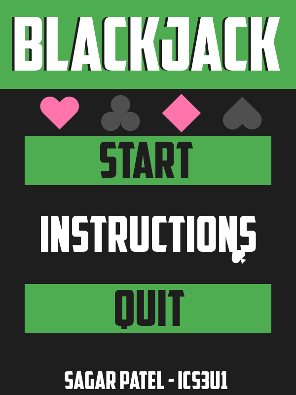
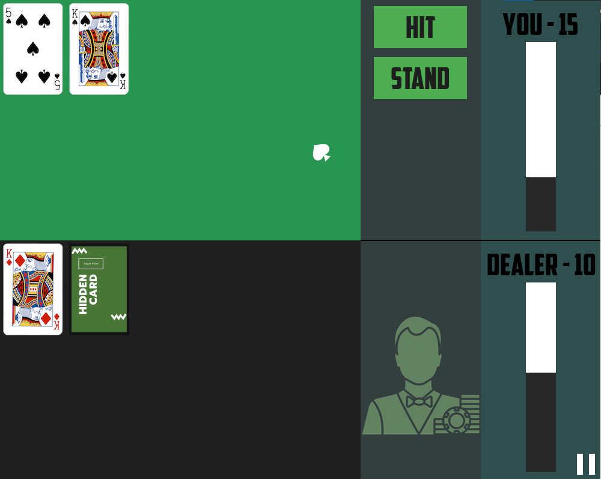
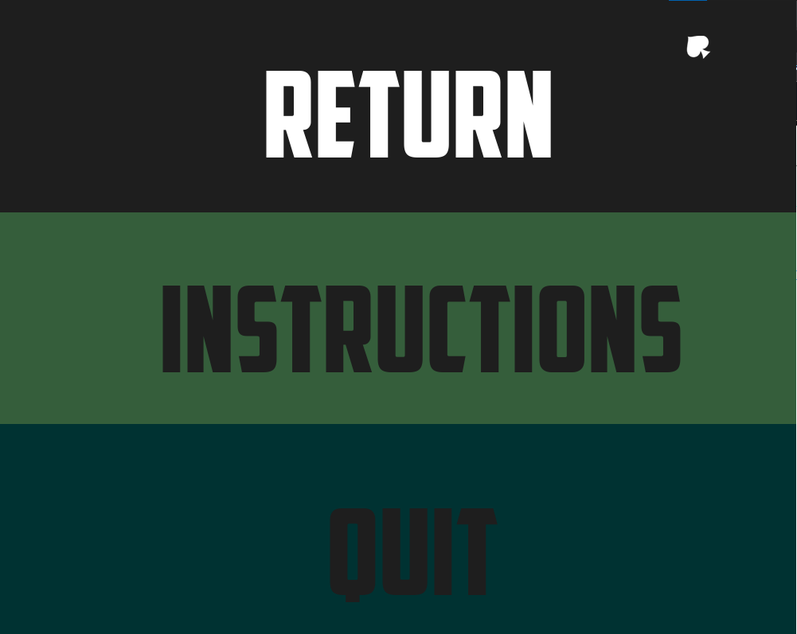
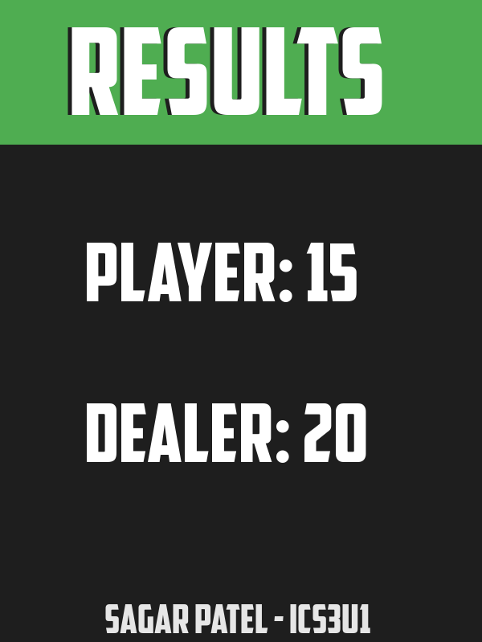
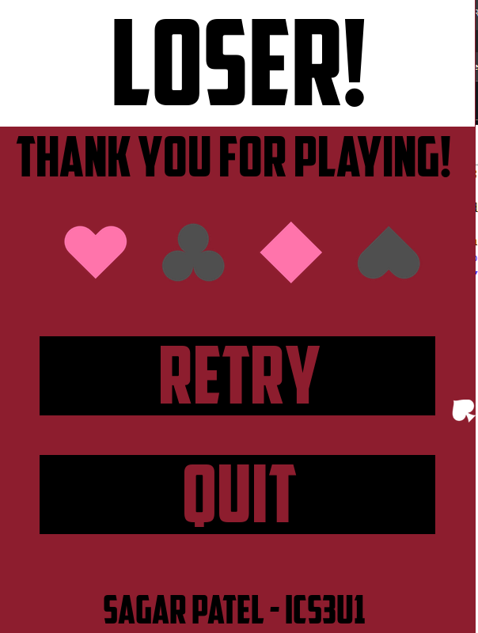
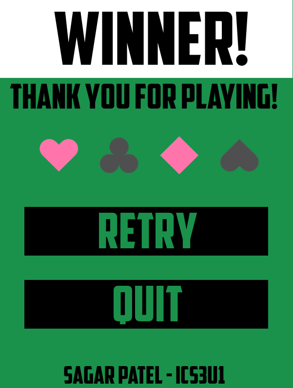
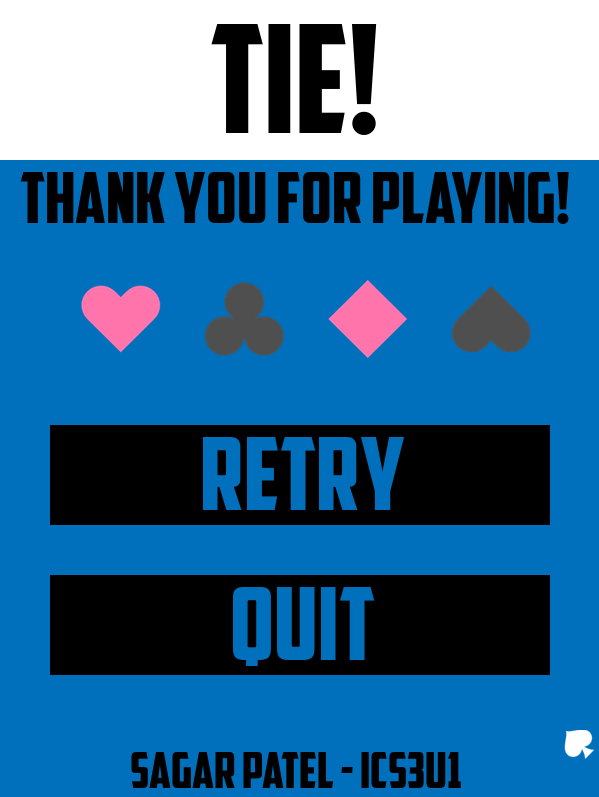

# ICS3U1-Project
This project was created as part of my final assignment in *Grade 11 Introduction to Computer Science*. The project was a graphical blackjack game using Pygame in Python 3.

## Disclaimers:
```diff 
- This is a naive implementation and terribly styled code (eg. global variables, not modularized, etc.) -
```
```diff 
- To run this program, you must copy all files from the Images directory into the directory with main.py -
```

## Table of Contents
* [Dependencies](#dependencies)
* [Installation](#installation)
* [Contributors](#contributors)
* [Contact](#contact)


## Dependencies
* [Python 3.7.4](https://www.python.org/downloads)
* [Pygame 1.9.6](https://www.pygame.org/download.shtml)


## Installation
* Make sure all the dependencies are installed
* Download the files
  * Option 1: 🍴 Fork this repository!
  * Option 2: 🧪 Clone the repository to your local machine using https://github.com/sagarpatel211/ICS3U1-Project.git!
* Run main.py in Python 3.7.4 or in another code editor to run the program

## Screenshots
| MainPage    | Register    |
|-------------|-------------|
|  |  |
| Login       | Stopwatch   |
|  |  |
| History     | To Do       |
|  |  |
| Dashboard   |
|  |

## Contributors
| <a href="https://github.com/sagarpatel211" target="_blank">**Sagar Patel**</a> |
| :---: |
| [](https://github.com/sagarpatel211)    |
| <a href="https://github.com/sagarpatel211" target="_blank">`github.com/sagarpatel211`</a> |


## Contact
[Email](mailto:sa24pate@uwaterloo.ca) | [Website](https://sagarpatel211.github.io/)
